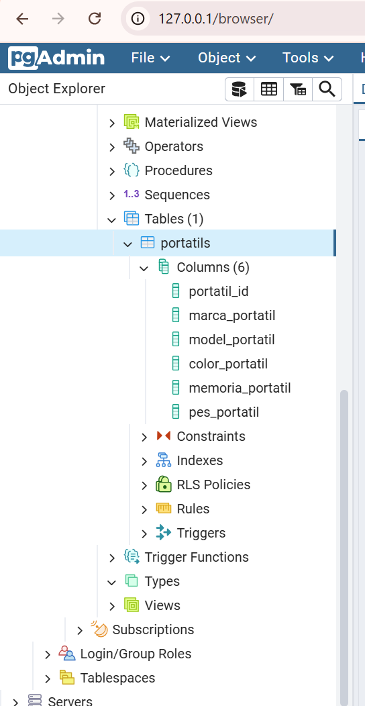
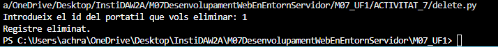
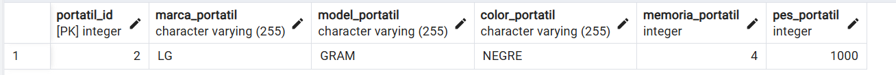
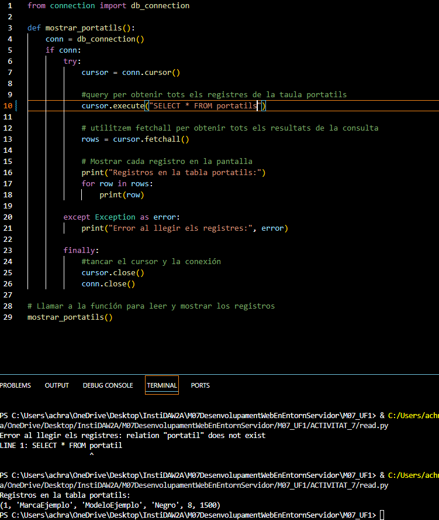
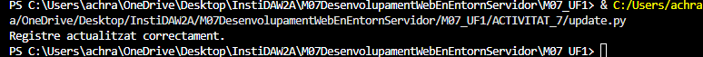
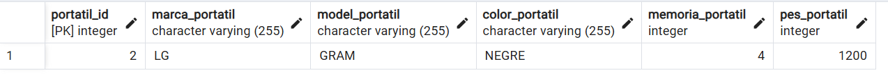

# M07_UF1

# Projecte CRUD de Portàtils

Aquest projecte implementa operacions CRUD (Crear, Llegir, Actualitzar, Eliminar) per gestionar portàtils a una base de dades PostgreSQL.

## Arxius del Projecte
- **create_table**: és l'arxiu que conte la funcio que se encarrega de crear una nova taula a la base de dades.
## Prova:

- **create.py**: Conté la funció per crear un nou portàtil a la taula de la base de dades.

- **read.py**: Conté la funció per llegir i mostrar tots els portàtils de la taula.

- **update.py**: Conté la funció per actualitzar un portàtil existent a la base de dades.

- **delete.py**: Conté la funció per eliminar un portàtil existent de la taula.

- **connexion.py**: Configura la connexió amb la base de dades.

- **Main.py**: Conté el menú principal per seleccionar l'operació CRUD que es vol realitzar.

